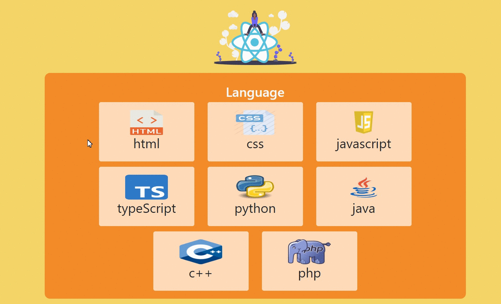
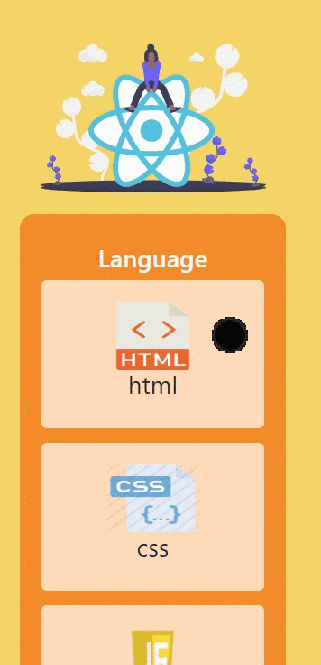

# Programming Language Cards 

## Description

Project aims to create a Programming Languages Cards App.

## Project Skeleton

```
Language Cards(folder)
|
|----readme.md 
SOLUTION
├── public
│     └── index.html
├── src
|    ├── assets.js
│    │       └── [images]
│    ├── components
│    │       └── card.jsx
│    │       └── Header.jsx
│    │       └── Language.jsx
│    │            
│    ├── helper
│    │       └── data.js  
│    ├── App.js
│    ├── App.css
│    ├── index.js
│    └── index.css
├── package.json
└── yarn.lock
```


## Objective

Build a Programming Languages Cards App using ReactJS.

### At the end of the project, following topics are to be covered;

- HTML

- CSS

- JS

- ReactJS

### At the end of the project;

- improve coding skills within HTML & CSS & JS & ReactJS.

- use git commands (push, pull, commit, add etc.) and Github as Version Control System.


**<p align="center">&#9786; Happy Coding &#9997;</p>**

<br><br>
🌐 The desktop and mobile versions of the web page are as follows;🧭
<br><br>

## 🖥️Desktop version
<br>

<br>
<br>
<br>
<br>
<br>
<br>
<br>
<br>
<br>
<br><br><br><br><br><br><br><br><br>


## 📱Mobile version
<br>

<br>
<br>
<br>
<br>
<br>
<br>
<br>
<br>
<br>
<br><br><br><br><br><br><br><br><br>

**<p align="center">&#9786; Happy Coding &#9997;</p>**
